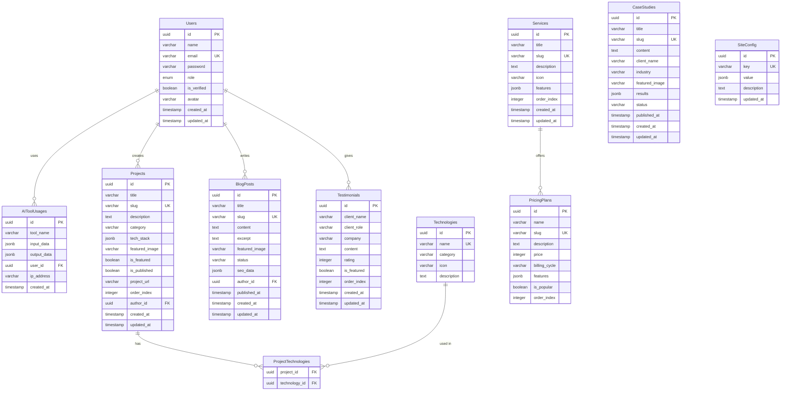

# 🗄️ Database Schema Documentation

## 📋 Table of Contents

- [🏗️ Database Architecture](#️-database-architecture)
- [📊 Entity Relationship Diagram](#-entity-relationship-diagram)
- [📝 Table Definitions](#-table-definitions)
- [🔗 Relationships](#-relationships)
- [📈 Indexes & Performance](️-indexes--performance)
- [🔄 Migration Strategy](#-migration-strategy)
- [🔍 Query Examples](#-query-examples)
- [📊 Data Seeding](#-data-seeding)
- [🔐 Security & Access](#-security--access)

## 🏗️ Database Architecture

### Database Overview

```
┌─────────────────────────────────────────────────────────────┐
│                    PostgreSQL Database                        │
│                    (NeonDB Hosting)                          │
├─────────────────────────────────────────────────────────────┤
│  ┌─────────────┐  ┌─────────────┐  ┌─────────────────────┐   │
│  │    Users    │  │  Projects   │  │   AIToolUsages     │   │
│  │             │  │             │  │                     │   │
│  │ - Auth      │  │ - Portfolio │  │ - AI Analytics     │   │
│  │ - Profiles  │  │ - Showcase  │  │ - Usage Tracking   │   │
│  │ - Roles     │  │ - Categories│  │ - Tool Logs         │   │
│  └─────────────┘  └─────────────┘  └─────────────────────┘   │
├─────────────────────────────────────────────────────────────┤
│  ┌─────────────┐  ┌─────────────┐  ┌─────────────────────┐   │
│  │  Services   │  │PricingPlans │  │   Testimonials     │   │
│  │             │  │             │  │                     │   │
│  │ - Catalog   │  │ - Pricing   │  │ - Client Feedback  │   │
│  │ - Features  │  │ - Tiers     │  │ - Ratings          │   │
│  │ - Ordering  │  │ - Features  │  │ - Featured         │   │
│  └─────────────┘  └─────────────┘  └─────────────────────┘   │
├─────────────────────────────────────────────────────────────┤
│  ┌─────────────┐  ┌─────────────┐  ┌─────────────────────┐   │
│  │  BlogPosts  │  │CaseStudies  │  │   SiteConfig       │   │
│  │             │  │             │  │                     │   │
│  │ - Content   │  │ - Stories   │  │ - Settings         │   │
│  │ - SEO       │  │ - Results   │  │ - Metadata         │   │
│  │ - Publishing│  │ - Media     │  │ - Configuration    │   │
│  └─────────────┘  └─────────────┘  └─────────────────────┘   │
└─────────────────────────────────────────────────────────────┘
```

### Database Design Principles

1. **Normalization**: 3NF compliance with strategic denormalization for performance
2. **UUID Primary Keys**: Distributed system friendly
3. **Timestamps**: Created/updated tracking on all entities
4. **Soft Deletes**: Logical deletion where appropriate
5. **Audit Trail**: Usage tracking and analytics
6. **Scalability**: Optimized for read-heavy workloads

### Technology Stack

- **Database**: PostgreSQL 15+ (NeonDB)
- **ORM**: SQLAlchemy 2.0 with async support
- **Migrations**: Alembic
- **Connection Pooling**: asyncpg with connection pooling
- **Indexing Strategy**: B-tree, GIN, and partial indexes

## 📊 Entity Relationship Diagram



## 📝 Table Definitions

### Users Table

```sql
CREATE TABLE users (
    id UUID PRIMARY KEY DEFAULT gen_random_uuid(),
    name VARCHAR(100) NOT NULL,
    email VARCHAR(255) UNIQUE NOT NULL,
    password VARCHAR(255) NOT NULL,
    role VARCHAR(10) DEFAULT 'USER' CHECK (role IN ('USER', 'ADMIN')),
    is_verified BOOLEAN DEFAULT FALSE,
    avatar VARCHAR(500),
    created_at TIMESTAMP WITH TIME ZONE DEFAULT NOW(),
    updated_at TIMESTAMP WITH TIME ZONE DEFAULT NOW()
);

-- Indexes
CREATE INDEX idx_users_email ON users(email);
CREATE INDEX idx_users_role ON users(role);
CREATE INDEX idx_users_created_at ON users(created_at);
CREATE INDEX idx_users_is_verified ON users(is_verified);

-- Comments
COMMENT ON TABLE users IS 'User accounts and authentication data';
COMMENT ON COLUMN users.id IS 'Unique identifier for the user';
COMMENT ON COLUMN users.name IS 'Full name of the user';
COMMENT ON COLUMN users.email IS 'Unique email address for login';
COMMENT ON COLUMN users.password IS 'Hashed password using bcrypt';
COMMENT ON COLUMN users.role IS 'User role: USER or ADMIN';
COMMENT ON COLUMN users.is_verified IS 'Email verification status';
COMMENT ON COLUMN users.avatar IS 'Profile avatar URL';
```

### Projects Table

```sql
CREATE TABLE projects (
    id UUID PRIMARY KEY DEFAULT gen_random_uuid(),
    title VARCHAR(200) NOT NULL,
    slug VARCHAR(200) UNIQUE NOT NULL,
    description TEXT,
    category VARCHAR(50),
    tech_stack JSONB,
    featured_image VARCHAR(500),
    is_featured BOOLEAN DEFAULT FALSE,
    is_published BOOLEAN DEFAULT FALSE,
    project_url VARCHAR(500),
    order_index INTEGER DEFAULT 0,
    author_id UUID REFERENCES users(id) ON DELETE SET NULL,
    created_at TIMESTAMP WITH TIME ZONE DEFAULT NOW(),
    updated_at TIMESTAMP WITH TIME ZONE DEFAULT NOW()
);

-- Indexes
CREATE INDEX idx_projects_slug ON projects(slug);
CREATE INDEX idx_projects_category ON projects(category);
CREATE INDEX idx_projects_published ON projects(is_published);
CREATE INDEX idx_projects_featured ON projects(is_featured);
CREATE INDEX idx_projects_author ON projects(author_id);
CREATE INDEX idx_projects_created_at ON projects(created_at);
CREATE INDEX idx_projects_order ON projects(order_index);

-- GIN index for JSONB tech_stack
CREATE INDEX idx_projects_tech_stack ON projects USING GIN(tech_stack);

-- Comments
COMMENT ON TABLE projects IS 'Portfolio projects showcase';
COMMENT ON COLUMN projects.tech_stack IS 'JSON array of technologies used';
COMMENT ON COLUMN projects.is_featured IS 'Featured project status';
COMMENT ON COLUMN projects.is_published IS 'Publication status';
COMMENT ON COLUMN projects.order_index IS 'Display order';
```

### AIToolUsages Table

```sql
CREATE TABLE ai_tool_usages (
    id UUID PRIMARY KEY DEFAULT gen_random_uuid(),
    tool_name VARCHAR(100) NOT NULL,
    input_data JSONB,
    output_data JSONB,
    user_id UUID REFERENCES users(id) ON DELETE SET NULL,
    ip_address VARCHAR(50),
    created_at TIMESTAMP WITH TIME ZONE DEFAULT NOW()
);

-- Indexes
CREATE INDEX idx_ai_usages_tool ON ai_tool_usages(tool_name);
CREATE INDEX idx_ai_usages_user ON ai_tool_usages(user_id);
CREATE INDEX idx_ai_usages_created ON ai_tool_usages(created_at);
CREATE INDEX idx_ai_usages_ip ON ai_tool_usages(ip_address);

-- GIN indexes for JSONB data
CREATE INDEX idx_ai_usages_input ON ai_tool_usages USING GIN(input_data);
CREATE INDEX idx_ai_usages_output ON ai_tool_usages USING GIN(output_data);

-- Comments
COMMENT ON TABLE ai_tool_usages IS 'AI tool usage tracking and analytics';
COMMENT ON COLUMN ai_tool_usages.tool_name IS 'Name of the AI tool used';
COMMENT ON COLUMN ai_tool_usages.input_data IS 'Input parameters and data';
COMMENT ON COLUMN ai_tool_usages.output_data IS 'AI tool response and results';
```

### Services Table

```sql
CREATE TABLE services (
    id UUID PRIMARY KEY DEFAULT gen_random_uuid(),
    title VARCHAR(200) NOT NULL,
    slug VARCHAR(200) UNIQUE NOT NULL,
    description TEXT,
    icon VARCHAR(50),
    features JSONB,
    order_index INTEGER DEFAULT 0,
    created_at TIMESTAMP WITH TIME ZONE DEFAULT NOW(),
    updated_at TIMESTAMP WITH TIME ZONE DEFAULT NOW()
);

-- Indexes
CREATE INDEX idx_services_slug ON services(slug);
CREATE INDEX idx_services_order ON services(order_index);

-- GIN index for features
CREATE INDEX idx_services_features ON services USING GIN(features);

-- Comments
COMMENT ON TABLE services IS 'Service offerings catalog';
COMMENT ON COLUMN services.features IS 'JSON array of service features';
COMMENT ON COLUMN services.order_index IS 'Display order for services';
```

### PricingPlans Table

```sql
CREATE TABLE pricing_plans (
    id UUID PRIMARY KEY DEFAULT gen_random_uuid(),
    name VARCHAR(100) NOT NULL,
    slug VARCHAR(100) UNIQUE NOT NULL,
    description TEXT,
    price INTEGER NOT NULL,
    billing_cycle VARCHAR(20) DEFAULT 'ONE_TIME',
    features JSONB,
    is_popular BOOLEAN DEFAULT FALSE,
    order_index INTEGER DEFAULT 0
);

-- Indexes
CREATE INDEX idx_pricing_slug ON pricing_plans(slug);
CREATE INDEX idx_pricing_popular ON pricing_plans(is_popular);
CREATE INDEX idx_pricing_order ON pricing_plans(order_index);

-- GIN index for features
CREATE INDEX idx_pricing_features ON pricing_plans USING GIN(features);

-- Comments
COMMENT ON TABLE pricing_plans IS 'Service pricing plans and tiers';
COMMENT ON COLUMN pricing_plans.price IS 'Price in cents/lowest currency unit';
COMMENT ON COLUMN pricing_plans.billing_cycle IS 'Billing cycle: ONE_TIME, MONTHLY, YEARLY';
COMMENT ON COLUMN pricing_plans.features IS 'JSON array of plan features';
```

### Testimonials Table

```sql
CREATE TABLE testimonials (
    id UUID PRIMARY KEY DEFAULT gen_random_uuid(),
    client_name VARCHAR(100) NOT NULL,
    client_role VARCHAR(100),
    company VARCHAR(100),
    content TEXT NOT NULL,
    rating INTEGER CHECK (rating >= 1 AND rating <= 5),
    is_featured BOOLEAN DEFAULT FALSE,
    order_index INTEGER DEFAULT 0,
    created_at TIMESTAMP WITH TIME ZONE DEFAULT NOW(),
    updated_at TIMESTAMP WITH TIME ZONE DEFAULT NOW()
);

-- Indexes
CREATE INDEX idx_testimonials_featured ON testimonials(is_featured);
CREATE INDEX idx_testimonials_rating ON testimonials(rating);
CREATE INDEX idx_testimonials_order ON testimonials(order_index);

-- Comments
COMMENT ON TABLE testimonials IS 'Client testimonials and reviews';
COMMENT ON COLUMN testimonials.rating IS '1-5 star rating';
COMMENT ON COLUMN testimonials.is_featured IS 'Featured testimonial status';
```

### BlogPosts Table

```sql
CREATE TABLE blog_posts (
    id UUID PRIMARY KEY DEFAULT gen_random_uuid(),
    title VARCHAR(200) NOT NULL,
    slug VARCHAR(200) UNIQUE NOT NULL,
    content TEXT NOT NULL,
    excerpt TEXT,
    featured_image VARCHAR(500),
    status VARCHAR(20) DEFAULT 'DRAFT' CHECK (status IN ('DRAFT', 'PUBLISHED', 'ARCHIVED')),
    seo_data JSONB,
    author_id UUID REFERENCES users(id) ON DELETE SET NULL,
    published_at TIMESTAMP WITH TIME ZONE,
    created_at TIMESTAMP WITH TIME ZONE DEFAULT NOW(),
    updated_at TIMESTAMP WITH TIME ZONE DEFAULT NOW()
);

-- Indexes
CREATE INDEX idx_blog_posts_slug ON blog_posts(slug);
CREATE INDEX idx_blog_posts_status ON blog_posts(status);
CREATE INDEX idx_blog_posts_author ON blog_posts(author_id);
CREATE INDEX idx_blog_posts_published ON blog_posts(published_at);
CREATE INDEX idx_blog_posts_created ON blog_posts(created_at);

-- GIN index for SEO data
CREATE INDEX idx_blog_posts_seo ON blog_posts USING GIN(seo_data);

-- Comments
COMMENT ON TABLE blog_posts IS 'Blog articles and content';
COMMENT ON COLUMN blog_posts.seo_data IS 'SEO metadata: title, description, keywords';
COMMENT ON COLUMN blog_posts.published_at IS 'Publication date';
```

### CaseStudies Table

```sql
CREATE TABLE case_studies (
    id UUID PRIMARY KEY DEFAULT gen_random_uuid(),
    title VARCHAR(200) NOT NULL,
    slug VARCHAR(200) UNIQUE NOT NULL,
    content TEXT NOT NULL,
    client_name VARCHAR(100) NOT NULL,
    industry VARCHAR(100),
    featured_image VARCHAR(500),
    results JSONB,
    status VARCHAR(20) DEFAULT 'DRAFT' CHECK (status IN ('DRAFT', 'PUBLISHED', 'ARCHIVED')),
    published_at TIMESTAMP WITH TIME ZONE,
    created_at TIMESTAMP WITH TIME ZONE DEFAULT NOW(),
    updated_at TIMESTAMP WITH TIME ZONE DEFAULT NOW()
);

-- Indexes
CREATE INDEX idx_case_studies_slug ON case_studies(slug);
CREATE INDEX idx_case_studies_status ON case_studies(status);
CREATE INDEX idx_case_studies_industry ON case_studies(industry);
CREATE INDEX idx_case_studies_published ON case_studies(published_at);

-- GIN index for results
CREATE INDEX idx_case_studies_results ON case_studies USING GIN(results);

-- Comments
COMMENT ON TABLE case_studies IS 'Case studies and success stories';
COMMENT ON COLUMN case_studies.results IS 'JSON with metrics and outcomes';
```

### Technologies Table

```sql
CREATE TABLE technologies (
    id UUID PRIMARY KEY DEFAULT gen_random_uuid(),
    name VARCHAR(100) UNIQUE NOT NULL,
    category VARCHAR(50),
    icon VARCHAR(50),
    description TEXT,
    created_at TIMESTAMP WITH TIME ZONE DEFAULT NOW()
);

-- Indexes
CREATE INDEX idx_technologies_name ON technologies(name);
CREATE INDEX idx_technologies_category ON technologies(category);

-- Comments
COMMENT ON TABLE technologies IS 'Technology stack reference data';
COMMENT ON COLUMN technologies.category IS 'Category: frontend, backend, database, etc.';
```

### ProjectTechnologies Junction Table

```sql
CREATE TABLE project_technologies (
    project_id UUID REFERENCES projects(id) ON DELETE CASCADE,
    technology_id UUID REFERENCES technologies(id) ON DELETE CASCADE,
    PRIMARY KEY (project_id, technology_id)
);

-- Comments
COMMENT ON TABLE project_technologies IS 'Many-to-many relationship between projects and technologies';
```

### SiteConfig Table

```sql
CREATE TABLE site_config (
    id UUID PRIMARY KEY DEFAULT gen_random_uuid(),
    key VARCHAR(100) UNIQUE NOT NULL,
    value JSONB NOT NULL,
    description TEXT,
    updated_at TIMESTAMP WITH TIME ZONE DEFAULT NOW()
);

-- Indexes
CREATE INDEX idx_site_config_key ON site_config(key);

-- Comments
COMMENT ON TABLE site_config IS 'Site-wide configuration and settings';
COMMENT ON COLUMN site_config.value IS 'JSON value for configuration';
```

## 🔗 Relationships

### One-to-Many Relationships

#### Users → Projects
```sql
-- One user can create many projects
ALTER TABLE projects 
ADD CONSTRAINT fk_projects_author 
FOREIGN KEY (author_id) REFERENCES users(id) 
ON DELETE SET NULL;

-- Query example: Get all projects by user
SELECT p.*, u.name as author_name
FROM projects p
JOIN users u ON p.author_id = u.id
WHERE u.id = $1
ORDER BY p.created_at DESC;
```

#### Users → AIToolUsages
```sql
-- One user can have many AI tool usages
ALTER TABLE ai_tool_usages 
ADD CONSTRAINT fk_ai_usages_user 
FOREIGN KEY (user_id) REFERENCES users(id) 
ON DELETE SET NULL;

-- Query example: Get AI usage statistics for user
SELECT 
    tool_name,
    COUNT(*) as usage_count,
    MAX(created_at) as last_used
FROM ai_tool_usages
WHERE user_id = $1
GROUP BY tool_name
ORDER BY usage_count DESC;
```

### Many-to-Many Relationships

#### Projects ↔ Technologies
```sql
-- Junction table for many-to-many
CREATE TABLE project_technologies (
    project_id UUID REFERENCES projects(id) ON DELETE CASCADE,
    technology_id UUID REFERENCES technologies(id) ON DELETE CASCADE,
    PRIMARY KEY (project_id, technology_id)
);

-- Query example: Get projects with specific technology
SELECT p.*, t.name as tech_name
FROM projects p
JOIN project_technologies pt ON p.id = pt.project_id
JOIN technologies t ON pt.technology_id = t.id
WHERE t.name = 'React'
AND p.is_published = true;
```

### Self-Referencing Relationships (Future Expansion)

```sql
-- For hierarchical data (e.g., project categories)
-- Not currently implemented but designed for future use
```

## 📈 Indexes & Performance

### Primary Indexes

```sql
-- UUID primary keys are automatically indexed
-- Additional indexes for performance:

-- Composite indexes for common queries
CREATE INDEX idx_projects_published_featured ON projects(is_published, is_featured, order_index);
CREATE INDEX idx_ai_usages_user_tool ON ai_tool_usages(user_id, tool_name, created_at);
CREATE INDEX idx_blog_posts_status_published ON blog_posts(status, published_at DESC);
```

### Partial Indexes

```sql
-- Index only published projects (most common query)
CREATE INDEX idx_projects_published_only ON projects(created_at DESC) 
WHERE is_published = true;

-- Index only featured items
CREATE INDEX idx_projects_featured_only ON projects(order_index) 
WHERE is_featured = true;

-- Index only recent AI usage (last 30 days)
CREATE INDEX idx_ai_usages_recent ON ai_tool_usages(created_at, tool_name) 
WHERE created_at > NOW() - INTERVAL '30 days';
```

### GIN Indexes for JSONB

```sql
-- For JSONB queries on tech_stack
CREATE INDEX idx_projects_tech_stack_gin ON projects USING GIN(tech_stack);

-- For JSONB queries on features
CREATE INDEX idx_services_features_gin ON services USING GIN(features);
CREATE INDEX idx_pricing_features_gin ON pricing_plans USING GIN(features);

-- For JSONB queries on AI data
CREATE INDEX idx_ai_usages_input_gin ON ai_tool_usages USING GIN(input_data);
CREATE INDEX idx_ai_usages_output_gin ON ai_tool_usages USING GIN(output_data);
```

### Performance Monitoring

```sql
-- Query to check index usage
SELECT 
    schemaname,
    tablename,
    indexname,
    idx_scan,
    idx_tup_read,
    idx_tup_fetch
FROM pg_stat_user_indexes
ORDER BY idx_scan DESC;

-- Query to check slow queries
SELECT 
    query,
    calls,
    total_time,
    mean_time,
    rows
FROM pg_stat_statements
ORDER BY mean_time DESC
LIMIT 10;
```

## 🔄 Migration Strategy

### Alembic Configuration

```python
# alembic/env.py
from alembic import context
from sqlalchemy import engine_from_config, pool
from app.db.base import Base
from app.core.config import settings

# Import all models
from app.models import (
    user, project, service, ai_tool_usage,
    pricing_plan, testimonial, blog_post, case_study,
    technology, site_config
)

target_metadata = Base.metadata

def run_migrations_online():
    """Run migrations in 'online' mode."""
    configuration = context.config
    configuration.set_main_option('sqlalchemy.url', settings.database_url)
    
    connectable = engine_from_config(
        configuration.get_section(configuration.config_ini_section),
        prefix='sqlalchemy.',
        poolclass=pool.NullPool,
    )

    with connectable.connect() as connection:
        context.configure(
            connection=connection,
            target_metadata=target_metadata,
            compare_type=True,
            compare_server_default=True
        )

        with context.begin_transaction():
            context.run_migrations()
```

### Migration Examples

```python
# alembic/versions/001_initial_migration.py
from alembic import op
import sqlalchemy as sa
from sqlalchemy.dialects import postgresql

def upgrade():
    # Create users table
    op.create_table('users',
        sa.Column('id', postgresql.UUID(as_uuid=True), nullable=False),
        sa.Column('name', sa.String(length=100), nullable=False),
        sa.Column('email', sa.String(length=255), nullable=False),
        sa.Column('password', sa.String(length=255), nullable=False),
        sa.Column('role', sa.Enum('USER', 'ADMIN', name='userrole'), nullable=False),
        sa.Column('is_verified', sa.Boolean(), nullable=False),
        sa.Column('avatar', sa.String(length=500), nullable=True),
        sa.Column('created_at', sa.DateTime(timezone=True), server_default=sa.text('now()'), nullable=False),
        sa.Column('updated_at', sa.DateTime(timezone=True), server_default=sa.text('now()'), nullable=False),
        sa.PrimaryKeyConstraint('id'),
        sa.UniqueConstraint('email')
    )
    
    # Create indexes
    op.create_index(op.f('ix_users_email'), 'users', ['email'], unique=False)
    op.create_index(op.f('ix_users_role'), 'users', ['role'], unique=False)

def downgrade():
    op.drop_index(op.f('ix_users_role'), table_name='users')
    op.drop_index(op.f('ix_users_email'), table_name='users')
    op.drop_table('users')
```

## 🔍 Query Examples

### Common Query Patterns

#### 1. User Dashboard Data

```sql
-- Get user's projects with stats
WITH user_projects AS (
    SELECT 
        p.id,
        p.title,
        p.slug,
        p.is_published,
        p.is_featured,
        p.created_at,
        COUNT(pt.technology_id) as tech_count
    FROM projects p
    LEFT JOIN project_technologies pt ON p.id = pt.project_id
    WHERE p.author_id = $1
    GROUP BY p.id, p.title, p.slug, p.is_published, p.is_featured, p.created_at
),
user_ai_usage AS (
    SELECT 
        tool_name,
        COUNT(*) as usage_count,
        MAX(created_at) as last_used
    FROM ai_tool_usages
    WHERE user_id = $1
    GROUP BY tool_name
)

SELECT 
    json_agg(
        json_build_object(
            'id', id,
            'title', title,
            'slug', slug,
            'is_published', is_published,
            'is_featured', is_featured,
            'tech_count', tech_count,
            'created_at', created_at
        )
    ) as projects,
    json_agg(
        json_build_object(
            'tool_name', tool_name,
            'usage_count', usage_count,
            'last_used', last_used
        )
    ) as ai_usage
FROM user_projects, user_ai_usage;
```

#### 2. Project Search with Filters

```sql
-- Advanced project search
SELECT 
    p.id,
    p.title,
    p.slug,
    p.description,
    p.category,
    p.featured_image,
    p.is_featured,
    p.created_at,
    u.name as author_name,
    COALESCE(
        json_agg(
            json_build_object(
                'name', t.name,
                'category', t.category
            )
        ) FILTER (WHERE t.name IS NOT NULL),
        '[]'::json
    ) as technologies
FROM projects p
LEFT JOIN users u ON p.author_id = u.id
LEFT JOIN project_technologies pt ON p.id = pt.project_id
LEFT JOIN technologies t ON pt.technology_id = t.id
WHERE 
    p.is_published = true
    AND ($1::text IS NULL OR p.category = $1)
    AND ($2::text IS NULL OR (
        p.title ILIKE '%' || $2 || '%' OR 
        p.description ILIKE '%' || $2 || '%'
    ))
    AND ($3::boolean IS NULL OR p.is_featured = $3)
GROUP BY p.id, p.title, p.slug, p.description, p.category, p.featured_image, p.is_featured, p.created_at, u.name
ORDER BY 
    p.is_featured DESC,
    p.created_at DESC
LIMIT $4 OFFSET $5;
```

#### 3. AI Usage Analytics

```sql
-- AI tool usage statistics
WITH daily_usage AS (
    SELECT 
        DATE(created_at) as date,
        tool_name,
        COUNT(*) as usage_count,
        COUNT(DISTINCT user_id) as unique_users
    FROM ai_tool_usages
    WHERE created_at >= NOW() - INTERVAL '30 days'
    GROUP BY DATE(created_at), tool_name
),
tool_summary AS (
    SELECT 
        tool_name,
        SUM(usage_count) as total_usage,
        AVG(usage_count) as avg_daily_usage,
        MAX(unique_users) as max_daily_users
    FROM daily_usage
    GROUP BY tool_name
)

SELECT 
    json_agg(
        json_build_object(
            'date', date,
            'tool_name', tool_name,
            'usage_count', usage_count,
            'unique_users', unique_users
        )
    ) FILTER (WHERE date IS NOT NULL) as daily_data,
    json_agg(
        json_build_object(
            'tool_name', tool_name,
            'total_usage', total_usage,
            'avg_daily_usage', ROUND(avg_daily_usage, 2),
            'max_daily_users', max_daily_users
        )
    ) as tool_summary
FROM daily_usage, tool_summary;
```

#### 4. Content Management

```sql
-- Get all content by author with status
SELECT 
    'blog' as content_type,
    id,
    title,
    slug,
    status,
    published_at,
    created_at
FROM blog_posts
WHERE author_id = $1

UNION ALL

SELECT 
    'case_study' as content_type,
    id,
    title,
    slug,
    status,
    published_at,
    created_at
FROM case_studies
WHERE published_at IS NOT NULL

ORDER BY created_at DESC;
```

### JSONB Query Examples

#### 1. Search in Tech Stack

```sql
-- Find projects using specific technology
SELECT title, slug, tech_stack
FROM projects
WHERE tech_stack ? 'React'
AND is_published = true;

-- Find projects with multiple technologies
SELECT title, slug, tech_stack
FROM projects
WHERE tech_stack ?& array['React', 'TypeScript', 'Next.js']
AND is_published = true;
```

#### 2. Service Features Search

```sql
-- Find services with specific features
SELECT title, features
FROM services
WHERE features @@ to_tsquery('english', 'api & development');

-- Extract specific feature from JSON
SELECT 
    title,
    features->>0 as first_feature
FROM services;
```

## 📊 Data Seeding

### Seed Data Structure

```python
# app/db/init_db.py
from sqlalchemy.ext.asyncio import AsyncSession
from app.models.user import User, UserRole
from app.models.project import Project, ProjectCategory
from app.models.service import Service
from app.core.security import SecurityManager
import json

async def seed_database(db: AsyncSession):
    """Seed database with initial data."""
    
    # 1. Create users
    admin_user = User(
        name="TFX Admin",
        email="admin@tfxai.com",
        password=SecurityManager.hash_password("Admin@123"),
        role=UserRole.ADMIN,
        is_verified=True
    )
    
    test_user = User(
        name="Test User",
        email="test@tfxai.com",
        password=SecurityManager.hash_password("Test@123"),
        role=UserRole.USER,
        is_verified=True
    )
    
    db.add_all([admin_user, test_user])
    await db.commit()
    
    # 2. Create services
    services = [
        Service(
            title="Web Development",
            slug="web-development",
            description="Custom web applications using modern technologies",
            features=json.dumps([
                "React/Next.js Development",
                "API Design & Implementation",
                "Database Design",
                "Responsive Design",
                "Performance Optimization"
            ]),
            order_index=1
        ),
        # ... more services
    ]
    
    for service in services:
        db.add(service)
    
    await db.commit()
    
    # 3. Create projects
    projects = [
        Project(
            title="ClinicMind AI",
            slug="clinicmind-ai",
            description="AI-powered hospital management system",
            category="AI",
            tech_stack=json.dumps(["Next.js", "FastAPI", "PostgreSQL", "OpenAI"]),
            is_featured=True,
            is_published=True,
            author_id=admin_user.id,
            order_index=1
        ),
        # ... more projects
    ]
    
    for project in projects:
        db.add(project)
    
    await db.commit()
```

### Seed Data Validation

```sql
-- Verify seed data
SELECT 
    (SELECT COUNT(*) FROM users) as user_count,
    (SELECT COUNT(*) FROM projects) as project_count,
    (SELECT COUNT(*) FROM services) as service_count,
    (SELECT COUNT(*) FROM pricing_plans) as pricing_count,
    (SELECT COUNT(*) FROM testimonials) as testimonial_count;

-- Check specific data
SELECT email, role, is_verified FROM users;
SELECT title, slug, is_published FROM projects;
SELECT name, slug FROM services;
```

## 🔐 Security & Access

### Database Security

```sql
-- Row Level Security (RLS) for multi-tenant data
ALTER TABLE projects ENABLE ROW LEVEL SECURITY;

-- Policy: Users can only see their own projects
CREATE POLICY user_projects_policy ON projects
    FOR ALL
    TO authenticated_user
    USING (author_id = current_setting('app.current_user_id')::uuid);

-- Policy: Admin can see all projects
CREATE POLICY admin_projects_policy ON projects
    FOR ALL
    TO admin_user
    USING (true);

-- Function to set current user context
CREATE OR REPLACE FUNCTION set_current_user_id()
RETURNS void AS $$
BEGIN
    PERFORM set_config('app.current_user_id', current_setting('request.jwt.claims.sub'), true);
END;
$$ LANGUAGE plpgsql;
```

### Data Encryption

```sql
-- Encrypt sensitive data (if needed)
CREATE EXTENSION IF NOT EXISTS pgcrypto;

-- Example: Encrypt API keys in site_config
INSERT INTO site_config (key, value, description)
VALUES (
    'gemini_api_key',
    crypt('your-api-key', gen_salt('bf')),
    'Encrypted Gemini API key'
);

-- Decrypt when needed
SELECT convert_from(decrypt(value::bytea, 'your-encryption-key', 'bf'), 'utf8')
FROM site_config
WHERE key = 'gemini_api_key';
```

### Backup Strategy

```sql
-- Create backup user
CREATE USER backup_user WITH PASSWORD 'secure_backup_password';
GRANT CONNECT ON DATABASE tfxai TO backup_user;
GRANT USAGE ON SCHEMA public TO backup_user;
GRANT SELECT ON ALL TABLES IN SCHEMA public TO backup_user;

-- Backup script example
-- pg_dump -h host -U backup_user -d tfxai --no-password --format=custom --file=backup.dump
```

---

## 📚 Summary

This database schema documentation provides:

1. **🏗️ Complete Architecture** - Database design and relationships
2. **📊 ERD Diagram** - Visual representation of entities
3. **📝 Table Definitions** - Detailed schema with comments
4. **🔗 Relationships** - Foreign keys and constraints
5. **📈 Performance** - Indexes and optimization strategies
6. **🔄 Migrations** - Alembic setup and examples
7. **🔍 Queries** - Common query patterns and examples
8. **📊 Seeding** - Initial data setup and validation
9. **🔐 Security** - Access control and encryption

This documentation enables developers to:
- Understand the complete database structure
- Write efficient queries
- Design new features
- Optimize performance
- Maintain data integrity

---

<div align="center">
  <p>🗄️ Database schema designed for scalability and performance</p>
  <p>📖 Comprehensive documentation for developer understanding</p>
</div>
